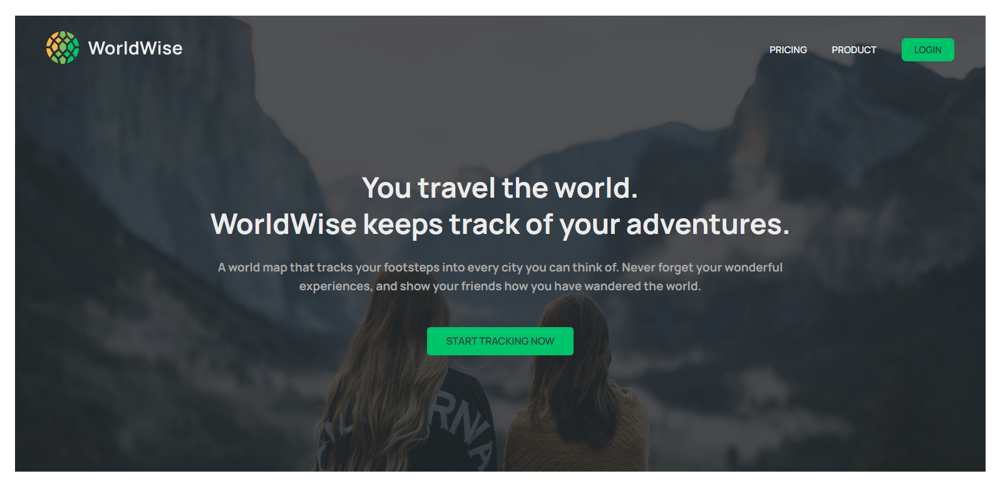

# Worldwise

> A world map that tracks your footsteps into every city you can think of. Never forget your wonderful experiences.

</img>

## Try it Live!

Check out the live app [The React Quiz](https://worldwise-flame.vercel.app/)

## Tools and Libraries Used

-   React
-   CSS Module
-   leaflet
-   react-leaflet
-   datepicker
-   json-server
-   react-router-dom
-   Vite

## Getting Started

1. Clone this repository.

    ```bash
    git clone https://github.com/mahmoud-mohsen-dev/worldwise.git
    ```

2. Navigate to the Project Directory:
    ```bash
    cd worldwise
    ```
3. Install Dependencies:

    ```bash
     npm install
    ```

4. Start the Development Server:

    ```bash
    npm run dev
    ```

5. Open in your Browser:

    Open your web browser and go to http://localhost:3000 to see the app in action.

Now you have the "worldwise" app up and running on your local machine.

_This poject was part of The Ulitmate React Couse_
